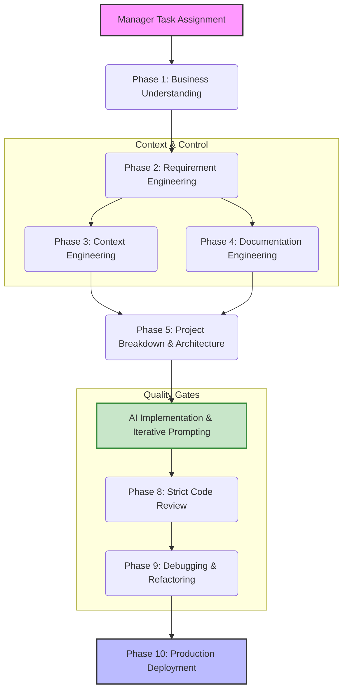

# Part 1: Foundations & Enterprise Mindset

Welcome to the foundation of the AI Engineering Masterclass. As your Principal AI Software Architect, my goal is to fundamentally alter your approach to software development. We are not here to memorize syntax; AI tools already know syntax better than we do. We are here to master **systems thinking, architecture, and workflow management**.

---

## 1. The Vibe Coder vs. The Junior Developer

In the modern enterprise, the difference between a Junior Developer and a Staff-level Vibe Coder is entirely defined by their first action when receiving a task.

### The Junior Developer Mindset
* **Action:** Receives a task -> Opens IDE -> Prompts AI: "Build a login page in React."
* **Result:** The AI generates a login page. It uses default Tailwind colors, no validation, local state for authentication, and directly connects to Firebase. 
* **The Problem:** When the manager asks to integrate with the company's existing OAuth provider, the code has to be thrown away. 

### The Staff Vibe Coder Mindset
* **Action:** Receives a task -> Stops -> Analyzes the business value -> Defines the architecture -> Writes documentation -> Prompts AI with strict boundaries.
* **Result:** A highly modular, secure, enterprise-grade system that integrates perfectly with existing company infrastructure.

---

## 2. The Unbreakable Enterprise AI Workflow

You must never let your AI jump directly into coding. The cost of a bug found in production is 100x higher than a bug found during planning. Below is the mandatory enterprise workflow.

---

## 3. Practical Simulation: The Manager Request

Let's put this into practice immediately. 

**The Scenario:** 
Your manager calls you into a meeting. *"We are losing track of our high-value clients. We need you to build a CRM for our sales team by next month. It should track customers, log calls, and have Microsoft Teams integration. Go build it."*

### ❌ The Wrong Approach (Coding First)
You open your AI coding tool and type: 
*"Create a Next.js CRM application with a PostgreSQL database to track customers, log calls, and integrate with Microsoft Teams."*
**Why this fails:** The AI will build a monolithic app. It will hallucinate a Teams integration using outdated V1 APIs. It won't know your company's branding, security policies, or database naming conventions. You will spend 3 weeks debugging AI-generated spaghetti code.

### ✅ The Staff Engineer Approach (Analysis First)

Before writing a single line of code or a single AI prompt, you must ask clarification questions to define the boundaries of the system. 

**Step 1: Understand the Business Goal**
* *Why are we losing track?* (Is it because the current Excel sheet is too big, or because salespeople are too lazy to log data?)
* *Who are the users?* (Just salespeople, or also managers and marketing?)

**Step 2: Clarify Ambiguities**
* *"Teams Integration" is vague.* Does this mean sending a message to a channel when a deal closes? Or does it mean scheduling Teams meetings from the CRM? (The architectural difference is massive).

**Step 3: Define Success**
* *How do we know we succeeded?* (e.g., "Sales reps log 100% of calls in the new system within the first week.")

---

## 4. Hands-on Exercise

**Your Task:**
Your manager says: *"Add an export feature to the HR dashboard so managers can download employee data."*

Write down the first **3 questions** you would ask before touching your AI tool.

> **Staff Engineer Solution & Rationale:**
> 1. **Security/Privacy:** "Which specific fields are included in the export? (e.g., Are we masking Social Security Numbers and Salaries?)" *Rationale: AI will blindly export `SELECT *`, causing a massive data breach.*
> 2. **Format/Scale:** "Do they need this in CSV, PDF, or Excel? How many records are we talking about? (100 or 100,000?)" *Rationale: Exporting 100k rows synchronously will crash the Node server. We might need a background queue architecture.*
> 3. **Auditing:** "Do we need to log who exported the data and when?" *Rationale: Enterprise compliance (SOC2/GDPR) often requires audit trails for data exports.*

---

## 5. Review Checklist

Before moving to Part 2, ensure you have internalized these rules:
- [ ] I will never use AI to generate code before defining the architecture.
- [ ] I understand that AI has no business context; I must provide it.
- [ ] I will treat AI as a junior developer who needs strict, step-by-step guidance.
- [ ] I will prioritize defining boundaries and edge cases over writing logic.

**Next Steps:**
In Part 2, we will take the answers from our business analysis and translate them into strict Markdown requirement files that an AI can natively parse and understand.
