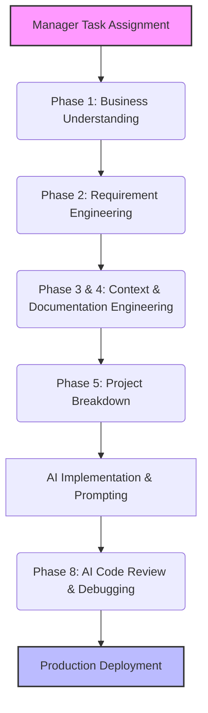

# Part 1: Foundations & Enterprise Mindset

Welcome to the start of your journey. As your Principal AI Software Architect, I will fundamentally change how you approach building software. We are not here to write code; we are here to **build systems**. 

## 1. The Staff Engineer Mindset vs. Junior Developer Mindset

In the enterprise world, junior developers receive a task and immediately open their IDE to start typing code. A Staff Engineer receives a task and starts asking questions. 

**Why companies do this:**
* **Risk Mitigation:** Writing code is the most expensive and risky part of software engineering.
* **Alignment:** 80% of project failures are due to misunderstood requirements, not technical incompetence.
* **Scale:** A junior engineer thinks about their single file. A staff engineer thinks about the entire system, team, and future maintainers (including AI).

### Common Mistakes
* **Developer Mistake:** "I'll figure out the architecture as I code."
* **AI Mistake:** AI tools will happily generate 500 lines of spaghetti code if you just give them a one-liner prompt. AI has no common sense; it only has context.

## 2. The Enterprise AI Workflow

You must never let your AI jump directly into coding. Below is the mandatory enterprise workflow we will follow for every project.

## 3. Practical Exercise: The Manager Request

**Scenario:** 
Your manager comes to your desk and says: *"We need you to build a CRM for ABC Limited by next month. It should track customers and have Microsoft Teams integration."*

**Your Task:**
Write down the first 3 things you would do. (Do not write any code).

### 4. Review & Staff Engineer Approach
*Did you start looking up 'Teams API'? If so, you failed.*

**Staff Engineer Approach:**
1. **Understand Business Goal:** Why does ABC Limited need this CRM? Are they replacing an old system or starting fresh? What is the main pain point right now?
2. **Clarification:** What does "Teams integration" mean? Notifications? Chatbots? Meeting scheduling? 
3. **Success Criteria:** How will we measure if this CRM is successful in one month?

**Next Steps:**
In Part 2, we will dive into translating these business needs into strict requirements that an AI can understand and execute flawlessly.
