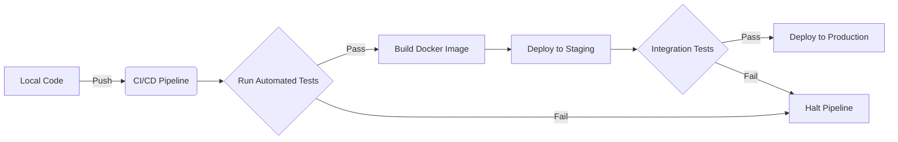

# Part 10: Production Deployment

"It works on my machine" is a junior developer's excuse. A Staff Engineer cares about how the system behaves under load, in production, with real users. AI tools are notoriously bad at deployment configuration because they don't know your infrastructure.

## 1. What AI Doesn't Know About Production

AI models often assume a perfect local environment. They forget about:
* Environment Variables (`.env`)
* CORS restrictions
* Database connection pooling
* Dockerization and container limits
* CI/CD pipelines (GitHub Actions, Jenkins)
* Observability (Datadog, Sentry)

## 2. The Deployment Pipeline

## 3. Preparing AI Code for Production

Before you deploy, you must prompt the AI specifically for production readiness.

**The Production Prompt:**
*"Review the entire authentication module. We are preparing for production deployment on AWS ECS.
1. Extract all hardcoded values into environment variables.
2. Add structured JSON logging for all errors.
3. Configure CORS to only allow `https://app.abclimited.com`.
4. Generate a `Dockerfile` optimized for production (multi-stage build)."*

### Common Mistakes
* **Developer Mistake:** Deploying with `DEBUG=True`.
* **AI Mistake:** Generating a `Dockerfile` that runs the development server (`npm run dev`) instead of serving static files (`npm run build`).

## 4. Practical Exercise: Pre-Deployment

**Scenario:**
You are deploying a Node.js API to production. The AI used SQLite during development. 

**Your Task:**
List 2 things you need to change before this goes to a production environment with multiple instances.

### 5. Review & Staff Engineer Approach

**Staff Engineer Approach:**
1. **Database:** SQLite is file-based and won't work across multiple instances. You must prompt the AI to migrate the connection to PostgreSQL or MySQL.
2. **State:** If the AI used in-memory sessions, you must prompt it to switch to Redis, or authentication will fail when users hit different server instances.

**Next Steps:**
In Part 11, we will apply everything we've learned to massive, real-world Enterprise Case Studies.
