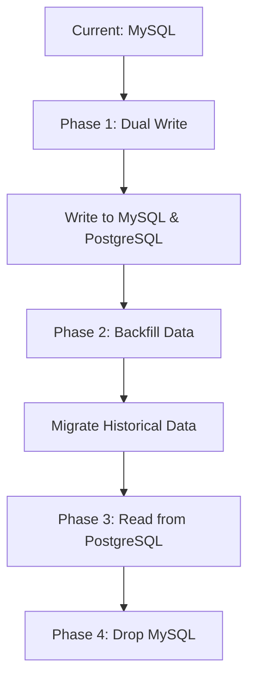

# Part 11: Enterprise Case Studies

It's time to put the theory into practice. When a manager gives you a massive assignment, you no longer panic, and you no longer blindly prompt an AI. You execute the system.

## 1. Case Study: Build a CRM for ABC Limited

**The Manager's Request:** "We need a custom CRM to track leads, manage customer communications, and integrate with Microsoft Teams."

### The Enterprise Execution Plan

1. **Phase 1 & 2 (Requirements):**
   * Prompt AI to generate clarification questions based on the prompt.
   * Finalize `BusinessRequirements.md` and `FunctionalRequirements.md`.
2. **Phase 4 (Documentation):**
   * Prompt AI: "Based on the CRM requirements, generate an `Architecture.md` proposing a microservices vs monolithic approach. Provide pros and cons."
   * Approve the monolith approach. Generate `DatabaseDesign.md`.
3. **Phase 5 (Breakdown):**
   * Prompt AI: "Break down the CRM into 4 core Modules. Then break Module 1 into 5 specific Tasks."
4. **Phase 7 & 8 (Workflow):**
   * Take Task 1 (e.g., Lead Database Schema).
   * Prompt AI: "Read `Architecture.md`. Implement the database schema for Leads."
   * Review code.
   * Proceed to Task 2.

## 2. Case Study: Database Migration

**The Manager's Request:** "Migrate our database from MySQL to PostgreSQL."

**How to use AI:**
Do not say "Write a script to migrate MySQL to Postgres."
Instead:
1. "Analyze the current MySQL schema and generate the equivalent PostgreSQL schema."
2. "Write an infrastructure plan for a Zero-Downtime Migration (Dual Write strategy)."
3. "Generate the database connection abstraction layer."

## 3. Practical Exercise: Roleplay

**Scenario:**
Manager: *"Add Role-Based Access Control (RBAC) to our existing React/Node application."*

**Your Task:**
Write out the names of the 3 Markdown documents you will create *before* you allow the AI to write any React or Node code.

### 4. Review & Staff Engineer Approach

**Staff Engineer Approach:**
1. `SecurityRules.md` (Defining the roles: Admin, Editor, Viewer).
2. `DatabaseDesign.md` (Mapping Users to Roles and Roles to Permissions).
3. `APIContracts.md` (Defining how the frontend will request a user's permissions, and how the backend will reject unauthorized requests).

**Next Steps:**
In Part 12, we reach the final stage: Your Capstone Project.
