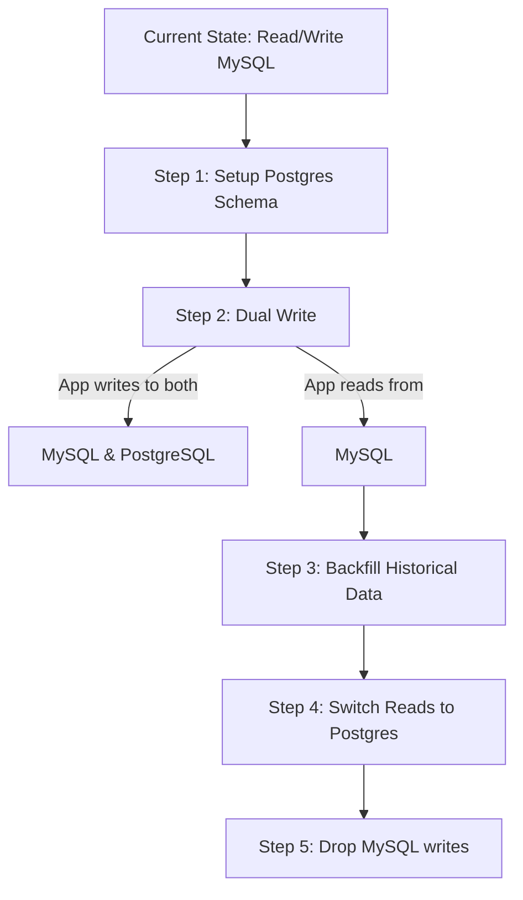

# Part 11: Enterprise Case Studies

It's time to put the theory into practice. When a manager gives you a massive assignment, you no longer panic, and you no longer blindly prompt an AI with "Build me an app." You execute the system step-by-step.

---

## 1. Case Study: Build a CRM for ABC Limited

**The Manager's Request:** "We need a custom CRM to track leads, manage customer communications, and integrate with Microsoft Teams. Have an MVP ready in 2 weeks."

### The Enterprise Execution Plan

#### Phase 1: Business Analysis & Requirements
* **Action:** You refuse to code. You analyze the business need.
* **AI Prompt:** *"I need to build a CRM to track leads and integrate with MS Teams. Act as a Senior Product Manager. Give me a list of 10 clarification questions I must ask stakeholders before designing the system."*
* **Output:** You gather the answers and write `BusinessRequirements.md`, `FunctionalRequirements.md`, and `EdgeCases.md`.

#### Phase 2: Architecture & Documentation
* **Action:** You define the boundaries.
* **AI Prompt:** *"Read `@BusinessRequirements.md`. Propose a high-level system architecture using Next.js and PostgreSQL. Do we need a Microservices architecture, or will a Modular Monolith suffice? Provide pros and cons."*
* **Output:** You approve the Modular Monolith approach. You generate `Architecture.md` and `DatabaseDesign.md`.

#### Phase 3: Project Breakdown (WBS)
* **Action:** You slice the elephant into bite-sized pieces.
* **AI Prompt:** *"Based on `@Architecture.md`, break the CRM down into 3 Epics. Then break Epic 1 (Lead Management) into 5 specific, sequential Implementation Tasks."*
* **Output:** The AI provides a Task list (e.g., 1. Define Lead Schema, 2. Build Lead API, etc.)

#### Phase 4: Iterative Implementation
* **Action:** You execute the tasks one by one using strict prompts.
* **AI Prompt:** *"@DatabaseDesign.md @Task1. Task: Implement the Lead Database Schema. Constraint: Use Prisma ORM. Do not generate UI code. Output the `schema.prisma` file."*

---

## 2. Case Study: Zero-Downtime Database Migration

**The Manager's Request:** "Migrate our core application database from MySQL to PostgreSQL. We cannot afford any downtime during the switch."

### The Wrong Way
Prompting AI: *"Write a Python script to copy data from MySQL to Postgres."*
(Result: The script takes 4 hours to run, during which the app is down, and any new data written to MySQL is lost).

### The Staff Engineer Way (Dual Write Strategy)

**How to use AI for this massive task:**
1. **Schema Migration:** *"Analyze the current `mysql_schema.sql` and generate the equivalent `postgres_schema.sql`, optimizing for Postgres-specific features (e.g., replacing JSON text fields with `JSONB`)."*
2. **Dual Write Logic:** *"Modify the `UserRepository`. For the `save()` method, implement a dual-write pattern. It must write to MySQL synchronously, and write to PostgreSQL asynchronously. If the Postgres write fails, log an error but do not fail the request."*
3. **Backfill Script:** *"Write a Node.js worker script to iterate through the MySQL database in chunks of 1000 and backfill historical records into Postgres. Ensure it handles rate limits."*

---

## 3. Hands-on Exercise: Roleplay

**Scenario:**
Manager: *"Add Role-Based Access Control (RBAC) to our existing enterprise application. We need Admins, Editors, and Viewers."*

**Your Task:**
Write out the names of the **3 specific Markdown documents** you will create or update *before* you allow the AI to write any code modifying the authentication logic.

> **Staff Engineer Solution & Rationale:**
> 1. `SecurityRules.md` - To define the exact capabilities of Admin vs. Editor vs. Viewer (e.g., "Only Admins can delete users").
> 2. `DatabaseDesign.md` - To define the new database tables needed (e.g., `roles` table, `user_roles` mapping table, `permissions` table).
> 3. `APIContracts.md` - To define how the frontend will request a user's permissions, and the exact HTTP status codes (401 vs 403) the backend will return for unauthorized requests.
> 
> *Rationale: RBAC touches every part of the system. If you let the AI guess the roles and permissions on the fly, you will have gaping security holes within minutes.*

---

## 4. Review Checklist

- [ ] I can apply the enterprise workflow to any assigned task, regardless of size.
- [ ] I understand that complex tasks (like migrations) require architectural strategies (like Dual Write) before AI implementation.
- [ ] I will rely on my documentation suite (`.md` files) as the source of truth for all case studies.

**Next Steps:**
In Part 12, we reach the final stage: Your Capstone Project Assessment.
