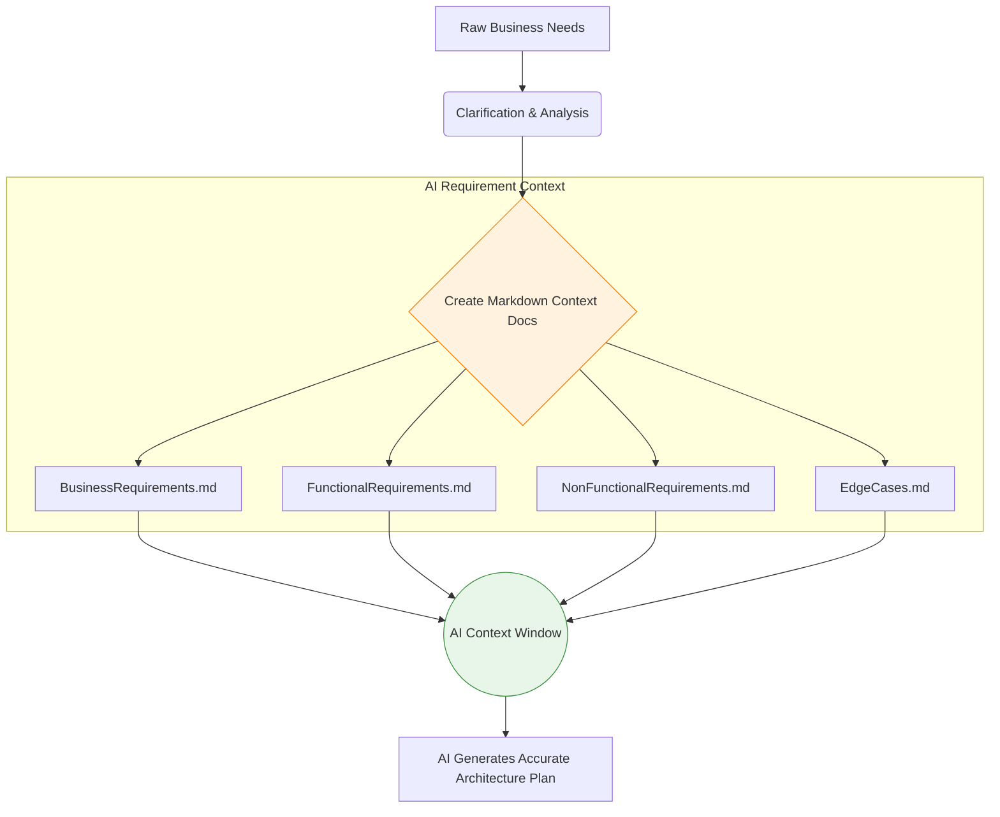

# Part 2: Business Analysis & Requirement Engineering

If you give an AI vague requirements, you will get a vague, buggy product. AI requires absolute clarity, zero ambiguity, and well-structured boundaries. In enterprise development, requirements are not just ideas in your head—they are structured Markdown documents that serve as the fundamental context for your AI.

---

## 1. Why Markdown Requirements?

When you tell an AI, "Add role-based access control," the AI assumes a standard pattern. But what if your enterprise has a custom hierarchical permission structure? The AI will hallucinate the wrong architecture.

By creating explicit Markdown files (`.md`), you are creating a **contract**. You will feed this contract to the AI, forcing it to adhere strictly to your business rules. LLMs parse Markdown headers (`#`, `##`) and lists (`*`, `-`) exceptionally well, making it the perfect medium for AI-human communication.

---

## 2. The Requirement Engineering Flow



---

## 3. Practical Templates for AI Context

You should maintain these files in a `/docs` or `/.ai-context` folder in your project root. Here is exactly how a Staff Engineer structures them for an AI tool.

### A. `FunctionalRequirements.md` (What it does)
Do not write paragraphs. Write strict bullet points. Use absolute language (MUST, SHALL, NEVER).

```markdown
# Functional Requirements: User Authentication Module

## 1. Registration
* System MUST allow registration via Email/Password and Google OAuth.
* System MUST send a verification email containing a 6-digit OTP upon email registration.
* Passwords MUST require 8+ chars, 1 uppercase, 1 special character.

## 2. Session Management
* System MUST use JWT (JSON Web Tokens) for API authentication.
* System MUST invalidate JWTs upon explicit user logout.
```

### B. `NonFunctionalRequirements.md` (How it performs)
AI will not optimize for performance or security unless explicitly told to in this file.

```markdown
# Non-Functional Requirements

## 1. Performance
* All API endpoints MUST respond in under 200ms at the 95th percentile.
* The application MUST support 10,000 concurrent active users.

## 2. Security
* All database passwords MUST be hashed using `bcrypt` with a minimum salt round of 12.
* The API MUST implement rate limiting (max 100 requests per minute per IP).
```

### C. `EdgeCases.md` (Where the system breaks)
This is where Junior developers fail. AI will only build the "Happy Path". You must define the edge cases so the AI generates the correct error handling.

```markdown
# Edge Cases & Error Handling: Loan Application

## 1. Concurrent Applications
* **Scenario:** User clicks "Submit" twice rapidly.
* **Handling:** System MUST implement an idempotency key to prevent duplicate loan entries.

## 2. Incomplete KYC
* **Scenario:** User applies for a loan but their KYC status is "Pending".
* **Handling:** System MUST reject the application and return HTTP 403 with code `ERR_KYC_PENDING`.
```

---

## 4. Hands-on Exercise: Extracting Requirements

**Scenario:**
Your manager asks you to: *"Build a 'Time Off Request' feature. Employees request leave, managers approve it."*

**Your Task:**
Write 3 strict bullet points for `EdgeCases.md` regarding this specific feature. Think like a Staff Engineer trying to prevent system failures.

> **Staff Engineer Solution & Rationale:**
> 1. **Scenario:** Manager is on leave.
>    **Handling:** System MUST auto-route approval requests to the Manager's designated proxy or the Department Head.
> 2. **Scenario:** Employee requests 5 days off, but only has 2 days of leave balance left.
>    **Handling:** System MUST reject the request at the UI level and return HTTP 400 from the API. It MUST NOT allow negative balances unless the `AllowNegativeLeave` flag is true.
> 3. **Scenario:** Employee requests leave spanning over a public holiday (e.g., Thursday to Monday, with Friday being a holiday).
>    **Handling:** System MUST automatically deduct only the working days (2 days) from the leave balance, ignoring weekends and public holidays.
> 
> *Rationale: If you do not provide this exact `EdgeCases.md` to the AI, it will just subtract End Date from Start Date, resulting in massive HR calculation errors.*

---

## 5. Review Checklist

- [ ] I understand that Requirements must be documented in Markdown.
- [ ] I will use absolute language (MUST, NEVER) when defining rules for AI.
- [ ] I will always create an `EdgeCases.md` file to force the AI to write robust error handling.
- [ ] I recognize that AI assumes the "Happy Path" by default unless instructed otherwise.

**Next Steps:**
In Part 3, we will learn the science of AI Context Engineering: how to feed these Markdown files into AI tools without the AI forgetting the rules halfway through the project.
