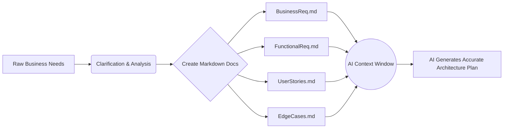

# Part 2: Business Analysis & Requirement Engineering

If you give an AI vague requirements, you will get a vague, buggy product. AI requires absolute clarity, zero ambiguity, and well-structured boundaries.

## 1. Why Requirement Engineering Matters

When you tell an AI, "Add role-based access control," the AI assumes a standard pattern. But what if your enterprise has a custom hierarchical permission structure? The AI will build the wrong thing, and you'll spend days debugging its "hallucination," which was actually just poor requirements.

**Enterprise Example:**
A banking system needs a "Loan Management System". 
* **Junior prompt:** "Build a loan management dashboard in React."
* **Senior preparation:** Creating `BusinessRequirements.md`, `FunctionalRequirements.md`, `EdgeCases.md`, and `AcceptanceCriteria.md`.

## 2. Requirement Flow to AI

## 3. Essential Requirement Files

* **`Requirement.md` / `BusinessRequirements.md`**: The high-level 'why'.
* **`FunctionalRequirements.md`**: Exactly what the system must do (e.g., "System must send email on loan approval").
* **`NonFunctionalRequirements.md`**: Performance, security, scalability (e.g., "API must respond in <200ms").
* **`EdgeCases.md`**: What happens when a user applies for a loan but their account was closed 5 minutes ago?

### Common Mistakes
* **Developer Mistake:** Keeping requirements in their head or in Slack messages.
* **AI Mistake:** Filling in the blanks with assumptions that violate business rules.

## 4. Practical Exercise: Requirement Extraction

**Scenario:**
Manager: *"Add a feature to our HRMS where employees can request time off, and managers can approve it."*

**Your Task:**
Write 3 bullet points for `EdgeCases.md` that you need to clarify before feeding this task to the AI.

### 5. Review & Staff Engineer Approach

**Staff Engineer Edge Cases:**
1. What happens if the employee submits the request, but their manager is also on leave? (Delegation routing).
2. What happens if the employee applies for unpaid leave, but they have a negative leave balance?
3. What happens if an employee submits a leave request spanning a public holiday?

**Next Steps:**
In Part 3, we will learn how to feed these documents into AI tools effectively without losing context.
