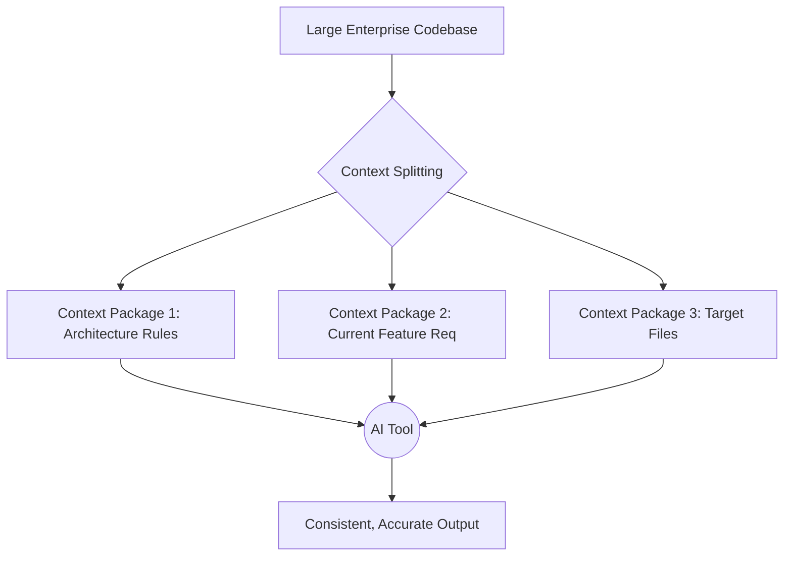

# Part 3: AI Context Engineering

This is the most critical skill for a Senior Vibe Coder. If you cannot manage an AI's context, you cannot build enterprise software. AI models have context windows (memory limits), and they suffer from "attention decay" (forgetting details in the middle of long prompts).

## 1. How AI Loses Context

An AI does not "read" your project the way a human does. It tokenizes text. If you dump 50 files into an AI tool like Cursor or Windsurf, the AI will:
1. Hallucinate variables that don't exist.
2. Forget the specific architectural rules you set.
3. Write inconsistent code across different files.

**Why companies care:**
Context loss leads to technical debt, regressions, and security vulnerabilities because the AI forgot a security rule defined 10,000 tokens ago.

## 2. Context Engineering Strategies

### Techniques:
* **Incremental Context:** Feed the AI the architecture rules first. Have it acknowledge them. Then feed the task.
* **Context Packages:** Create specific markdown files that act as "memory states" for the AI. (e.g., `CurrentState.md`).
* **Memory Recovery:** When AI starts making mistakes, do not argue with it. Clear the chat, create a new context package of the current state, and start a new session.

### Common Mistakes
* **Developer Mistake:** Highlighting the whole project and asking "Fix this bug."
* **AI Mistake:** Using outdated deprecated libraries because it saw them in an unrelated, old file in the context.

## 3. Practical Exercise: Splitting Context

**Scenario:**
You are refactoring the authentication module of a large SaaS platform. It touches 25 files (frontend, backend API, database schemas, and middleware).

**Your Task:**
How would you provide context to the AI so it doesn't break the existing system?

### 4. Review & Staff Engineer Approach

**Staff Engineer Approach:**
I would never give the AI all 25 files at once.
1. **Step 1:** Give AI the `Architecture.md` and the `SecurityRules.md`. Ask it to summarize the authentication strategy.
2. **Step 2:** Provide the database schema and ask it to write the new backend API contracts. Review and approve.
3. **Step 3:** Provide the backend code and the approved contracts. Have it implement the backend.
4. **Step 4:** Provide the frontend code and the approved contracts. Have it implement the UI.

**Next Steps:**
In Part 4, we will look at exactly how to write the Markdown files (`Architecture.md`, `SecurityRules.md`) that power this context engine.
