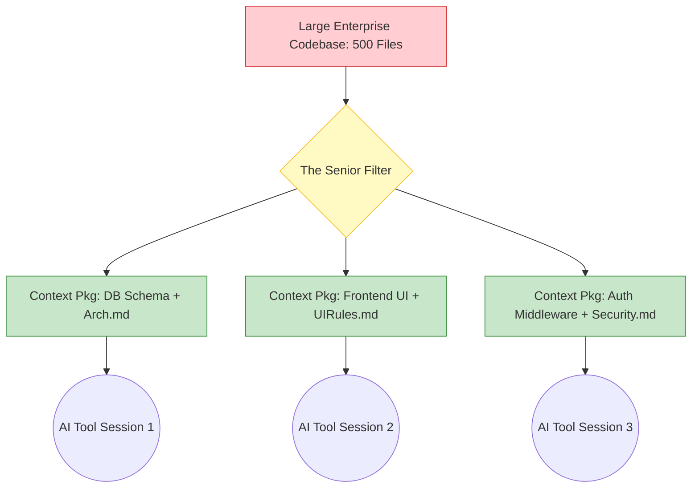

# Part 3: AI Context Engineering

Context Engineering is the most critical skill for a Senior Vibe Coder. If you cannot manage an AI's context window, your project will collapse under its own weight once it exceeds 10 files.

---

## 1. The Science of the Context Window

LLMs (like GPT-4o, Claude 3.5 Sonnet) have a limited "Context Window" (measured in tokens). Think of it as the AI's short-term working memory.

### The Problem: Attention Decay & Hallucination
Even if an AI tool supports 200,000 tokens, it suffers from **Attention Decay** (also known as the "Lost in the Middle" phenomenon). 
* If you dump 50 files into the AI, it will pay attention to the first 5 and the last 5. 
* It will forget the `SecurityRules.md` you placed in the middle.
* **Result:** It hallucinates variables, imports deprecated libraries, and breaks architectural rules.

---

## 2. Context Engineering Strategies

To prevent attention decay, Staff Engineers do not give the AI the whole project. They curate **Context Packages**.



### Strategy 1: The "Rules First" Approach (Incremental Context)
Never feed code and rules at the same time if the context is large.
1. **Prompt 1:** "Read `@Architecture.md` and `@CodingStandards.md`. Acknowledge that you understand our strict layered architecture. Do not write code yet."
2. **AI Response:** "I understand. I will enforce clean architecture..."
3. **Prompt 2:** "Now read `@UserController.ts`. Implement the new password reset flow according to the rules you just acknowledged."

### Strategy 2: Context Isolation (Session Refresh)
When working in a tool like Cursor or Windsurf, the chat history consumes tokens. If you have been debugging for 15 turns, the AI's memory is clogged with broken code and failed attempts.
* **Action:** Summarize the current state, clear the chat (start a new session), and paste the summary as the new starting context.

### Strategy 3: Dynamic Context Packaging
Create temporary `.md` files to bundle context for a specific task.
Example: `Context_StripeIntegration.md`
```markdown
# Context for Stripe Implementation
* Relevant DB Tables: `users`, `subscriptions`, `invoices`. (See `schema.sql`)
* Target File: `paymentService.ts`.
* Rule: Never log full credit card details. Always use Stripe Tokens.
```

---

## 3. Tool-Specific Context Mechanics

* **Cursor / Windsurf / Copilot Edits:** When you use `Cmd+K` or inline edits, the AI only sees the immediate surrounding code (often just the active file and a few tabs). You *must* explicitly use `@` mentions to force it to read requirement docs.
* **Antigravity / OpenHands (Agentic Tools):** These tools can traverse the file system. You must write a `PromptRules.md` or `SYSTEM_INSTRUCTIONS` file that explicitly commands the agent: *"Before starting any task, read `/docs/Architecture.md`."*

---

## 4. Hands-on Exercise: Structuring Context

**Scenario:**
You are migrating a massive legacy application from a Monolith to Microservices. You need the AI to extract the "Billing Module" into its own service. The monolith has 400 files.

**Your Task:**
Describe exactly how you will curate the context for the AI. What files or specific pieces of information will you provide in your prompt?

> **Staff Engineer Solution & Rationale:**
> I will absolutely *not* highlight the whole project.
> 1. **Phase 1 (Database Context):** I will extract only the `billing`, `invoices`, and `users` tables from the SQL dump. I will provide `@schema_subset.sql` and ask the AI to design the new Microservice database schema.
> 2. **Phase 2 (Interface Context):** I will provide the new schema and the old `BillingController.java` file. I will ask the AI to map the old endpoints to a new RESTful API contract (`APIContracts.md`).
> 3. **Phase 3 (Implementation Context):** Only after the API contract is approved, I will provide the contract and the empty new microservice repository, prompting the AI to implement the endpoints one by one.
> 
> *Rationale: By isolating the context to subsets, the AI remains hyper-focused and cannot accidentally entangle the new billing service with the legacy monolithic code.*

---

## 5. Review Checklist

- [ ] I understand what a Context Window is and how Attention Decay causes hallucinations.
- [ ] I will curate Context Packages instead of dumping entire folders into the AI.
- [ ] I will clear my AI chat sessions frequently to flush out irrelevant history.
- [ ] I will force the AI to read and acknowledge rules *before* providing the code to modify.

**Next Steps:**
In Part 4, we will dive into Documentation Engineering—creating the specific markdown files that act as the permanent "long-term memory" and instruction set for your AI.
