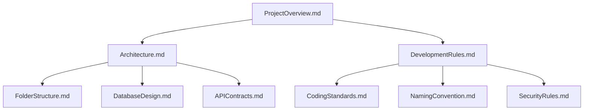

# Part 4: Documentation Engineering

Documentation is not an afterthought in AI-driven development; it is the **primary user interface** you use to control the AI. If your documentation is sloppy, your AI-generated code will be sloppy.

## 1. Why AI Needs Standardized Documentation

A human developer can look at code and guess the naming conventions or folder structures. An AI needs explicit rules, otherwise, it will invent its own patterns, leading to a fragmented, unmaintainable codebase.

**Senior Best Practice:**
Create a "Brain" or "Docs" folder containing specific markdown rules.

## 2. Documentation Dependency Tree



## 3. Core Enterprise Documents

* **`ProjectOverview.md`**: The absolute source of truth. If an AI reads only one file, it should be this. It contains the goal, stack, and current state.
* **`CodingStandards.md`**: Specific instructions like: *"Always use early returns. Never use standard loops; use array methods. Always type-hint functions."*
* **`PromptRules.md` / `CursorRules`**: AI-specific instructions: *"Never output code blocks unless asked. Always explain the architecture first. Do not delete comments."*

### Common Mistakes
* **Developer Mistake:** Writing docs meant for humans (flowery language, vague descriptions).
* **AI Mistake:** Ignoring implicit rules because they weren't explicitly documented in the system prompt or provided files.

## 4. Practical Exercise: Writing AI Instructions

**Scenario:**
You want the AI to implement a UI component, but you want to ensure it strictly uses Tailwind CSS and follows an Atomic Design pattern.

**Your Task:**
Write a 3-line `UIUXGuidelines.md` snippet designed specifically for an AI to read.

### 5. Review & Staff Engineer Approach

**Staff Engineer Snippet:**
```markdown
# UI Implementation Rules
1. ALWAYS use Tailwind CSS utility classes. NEVER write custom CSS or inline styles.
2. STRICTLY follow Atomic Design principles (Atoms, Molecules, Organisms). Put generic buttons in `/components/atoms`.
3. IF a color is needed, ONLY use the CSS variables defined in `tailwind.config.js` (e.g., `text-brand-primary`). DO NOT use hardcoded hex codes.
```
*Why this works:* It uses absolute directives (ALWAYS, NEVER, STRICTLY, ONLY) which LLMs parse much better than "please try to use..."

**Next Steps:**
In Part 5, we will take these documents and learn how to break down massive enterprise projects into bite-sized tasks for the AI.
