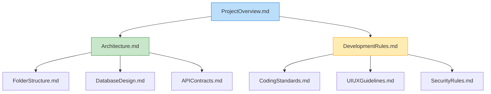

# Part 4: Documentation Engineering

Documentation in the era of AI is no longer a chore done at the end of a project for human onboarding. **Documentation is the primary programming language for controlling AI.** If you write poor documentation, your AI will write poor code.

---

## 1. Why AI Needs Standardized Documentation

A human developer can look at a codebase, infer the naming conventions, understand the folder structure, and make reasonable guesses. An AI has no intuition. It needs explicit, written rules, otherwise, it will revert to the statistical average of its training data (which often includes outdated and messy code).

### The "AI Brain" Folder Strategy
Enterprise projects should have a dedicated `/docs` or `/.context` folder containing strict Markdown files. This acts as the project's permanent memory.

---

## 2. The Documentation Dependency Tree



---

## 3. Core Enterprise Documents (Templates)

Here is exactly how to format these documents for maximum AI compliance.

### A. `ProjectOverview.md` (The Source of Truth)
If an AI reads only one file, it should be this. Keep it under 50 lines.
```markdown
# Project Overview: FinTrack Pro
**Goal:** A SaaS platform for SMBs to track expenses and generate tax reports.
**Tech Stack:** Next.js (App Router), Tailwind CSS, Node.js (Express), PostgreSQL, Prisma.
**Current State:** Authentication is complete. We are currently building the Dashboard module.
**Key Directives:** 
- ALWAYS refer to `Architecture.md` before generating backend code.
- NEVER use standard React `useState` for global state; strictly use Zustand.
```

### B. `CodingStandards.md` (Formatting and Style)
AI will format code inconsistently unless you lock it down.
```markdown
# Coding Standards
1. **Naming:** Use `camelCase` for variables/functions, `PascalCase` for classes/components, `UPPER_SNAKE_CASE` for constants.
2. **Early Returns:** ALWAYS use early return patterns to avoid nested `if/else` blocks.
3. **Type Safety:** STRICTLY use TypeScript interfaces for all function parameters and return types. NEVER use `any`.
4. **Comments:** DO NOT generate comments explaining obvious code. ONLY comment complex business logic.
```

### C. `PromptRules.md` or `.cursorrules` (Meta-Instructions)
These are instructions on *how the AI should behave* during the chat.
```markdown
# AI Interaction Rules
1. ALWAYS output your thought process in a `<thinking>` block before writing code.
2. DO NOT output the entire file if you only made a 2-line change. Output a git diff or just the modified function.
3. IF you encounter a missing dependency, DO NOT guess. Ask me for clarification.
```

---

## 4. Hands-on Exercise: Writing AI Instructions

**Scenario:**
You are building an e-commerce UI. You want to ensure the AI strictly uses Tailwind CSS, never writes custom CSS, and always follows Atomic Design principles (Atoms, Molecules, Organisms).

**Your Task:**
Write a highly specific, 3-rule `UIUXGuidelines.md` snippet designed to be parsed by an LLM.

> **Staff Engineer Solution & Rationale:**
> ```markdown
> # UI Implementation Rules
> 1. **CSS Framework:** STRICTLY use Tailwind CSS utility classes. NEVER write custom CSS files or inline `style={{}}` attributes.
> 2. **Component Structure:** ENFORCE Atomic Design. Place reusable generic UI (Buttons, Inputs) in `/src/components/atoms`. Place complex assemblies in `/src/components/organisms`.
> 3. **Design Tokens:** ONLY use the semantic color variables defined in `tailwind.config.js` (e.g., `bg-brand-primary`, `text-error-500`). DO NOT use hardcoded hex codes (e.g., `#FF0000`) or default Tailwind colors (e.g., `bg-red-500`) unless explicitly instructed.
> ```
> 
> *Rationale: By capitalizing action words (STRICTLY, NEVER, ENFORCE, ONLY), you trigger higher attention weights in the LLM's parsing engine, significantly reducing the chance of it ignoring the rule.*

---

## 5. Review Checklist

- [ ] I will create a dedicated docs folder to store AI context rules.
- [ ] I will write documentation using imperative, absolute language (ALWAYS, NEVER, STRICTLY).
- [ ] I will define the Tech Stack explicitly so the AI doesn't hallucinate older libraries.
- [ ] I understand that `.cursorrules` or `PromptRules.md` controls the AI's conversational behavior and output format.

**Next Steps:**
In Part 5, we will explore Enterprise Architecture—how to define the structural boundaries that prevent the AI from turning your project into a monolithic mess.
