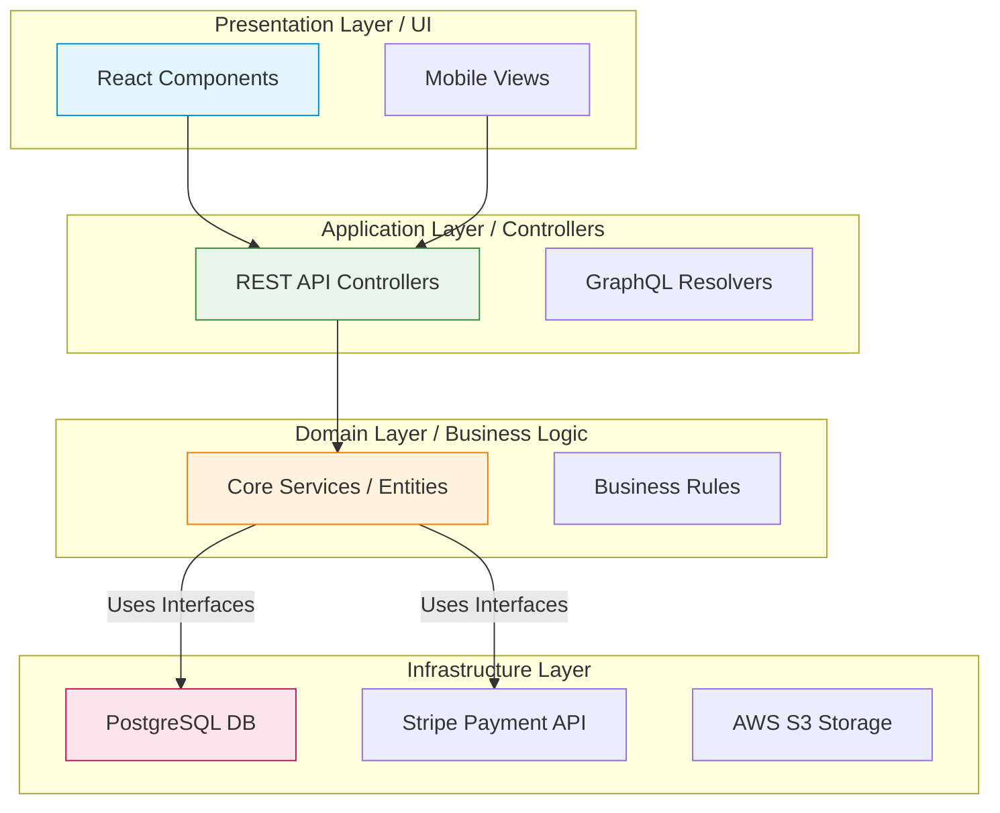

# Part 5: Enterprise Architecture

You cannot build a skyscraper without a blueprint, and you cannot build enterprise software without a defined architecture. If you ask an AI to "build a user service," and you don't define the architecture, it will likely build a monolithic, tightly-coupled script that is impossible to test or scale.

---

## 1. Why Define Architecture First?

AI models are trained on millions of open-source repositories. A vast majority of those repositories are small hobby projects, tutorials, or poorly structured legacy codebases. If you do not explicitly enforce an architecture, the AI will default to the most statistically common pattern, which is usually the worst one (e.g., writing SQL queries directly inside a React component).

**The Senior Rule:** You must define the architectural boundaries *before* any code is generated, and you must document those boundaries in `Architecture.md`.

---

## 2. Layered (Clean) Architecture

The most common enterprise architecture is Layered Architecture. You must force the AI to respect these boundaries.

### The Golden Rule of Clean Architecture:
**Dependencies point inward.** The Domain Layer (Business Logic) must never depend on the Infrastructure (Database, UI). If you change your database from MySQL to PostgreSQL, your business logic should not change by a single line.

---

## 3. Enforcing Architecture on AI

To ensure the AI doesn't violate these rules, your `Architecture.md` must contain strict constraints.

**Example snippet for `Architecture.md`:**
> * "The Domain layer (`/src/domain`) MUST NOT contain any references to the web framework (Express) or the database ORM (Prisma)."
> * "All database interactions MUST be abstracted behind Repository Interfaces defined in the Domain layer."
> * "Controllers MUST NOT contain business logic. They may only parse HTTP requests, pass DTOs to the Domain service, and return HTTP responses."

---

## 4. Hands-on Exercise: Architectural Constraints

**Scenario:**
You are building an e-commerce platform. The AI needs to calculate the shopping cart total, including state tax and seasonal discounts.

**Your Task:**
1. In which architectural layer must this calculation code reside?
2. Write the exact instruction you give the AI to ensure it puts the code there and doesn't mix it with infrastructure.

> **Staff Engineer Solution & Rationale:**
> 1. **Layer:** The Domain Layer (Core Business Logic).
> 2. **Instruction to AI:** *"Implement the `CalculateCartTotalService`. This must reside strictly in the Domain layer (`/src/domain/services/`). Constraint: It must have absolutely no dependencies on the web framework, the HTTP request context, or the database. Input is a purely typed `CartEntity`; output is a purely typed `MonetaryValue`. Do not inject any database repositories into this service."*
> 
> *Rationale: If you don't explicitly forbid HTTP and DB dependencies, the AI might write a service that accepts an `Express.Request` object and does a `db.carts.find()` inside the calculation logic, ruining your clean architecture and making unit testing impossible.*

---

## 5. Review Checklist

- [ ] I understand that AI defaults to bad architecture unless constrained.
- [ ] I will document the required architecture in `Architecture.md`.
- [ ] I know the difference between the Domain Layer (Logic) and Infrastructure Layer (DB/External).
- [ ] I will explicitly command the AI to keep business logic pure and decoupled from frameworks.

**Next Steps:**
Now that we have defined the architectural blueprint, Part 6 will cover how to break the massive project down into tiny tasks that the AI can execute flawlessly.
