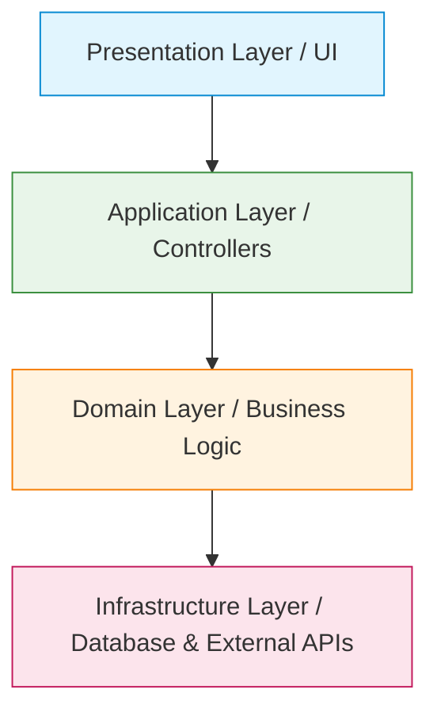

# Part 5: Enterprise Architecture

You cannot build a skyscraper without a blueprint, and you cannot build enterprise software without architecture. If you ask an AI to "build a user service," and you don't define the architecture, it will likely build a monolithic, tightly-coupled mess.

## 1. Why Define Architecture First?

AI models are trained on millions of open-source repositories. Most of those repositories are small, poorly structured, or use outdated patterns. If you don't enforce an architecture, the AI will default to the most common (and often worst) denominator.

**Senior Best Practice:**
Define the architectural boundaries *before* any code is generated. 

## 2. Layered Architecture Flow

## 3. Documenting Architecture for AI

You must create an `Architecture.md` file that strictly enforces boundaries. 

* **Rule 1:** UI components cannot query the database directly.
* **Rule 2:** Business logic must reside in the Domain layer.
* **Rule 3:** Infrastructure must be abstracted via interfaces (Dependency Inversion).

### Common Mistakes
* **Developer Mistake:** Letting the ORM bleed into the presentation layer.
* **AI Mistake:** Generating a React component that directly imports a Supabase database client and writes raw SQL, bypassing all security and business logic.

## 4. Practical Exercise: Architectural Constraints

**Scenario:**
You are building an e-commerce platform. The AI needs to calculate the shopping cart total, including tax and discounts.

**Your Task:**
In which layer (from the diagram above) must this calculation code reside, and what instruction do you give the AI to ensure it puts it there?

### 5. Review & Staff Engineer Approach

**Staff Engineer Approach:**
The calculation is pure business logic, so it belongs in the **Domain Layer**.
*Instruction to AI:* "Implement the `CalculateCartTotal` service. This must reside strictly in the Domain layer (`/src/domain/services/`). It must have no dependencies on the web framework or the database. Input is a Cart entity; output is a monetary value."

**Next Steps:**
Now that we have architecture, Part 6 will cover how to break the project down into tasks small enough for the AI to handle perfectly.
