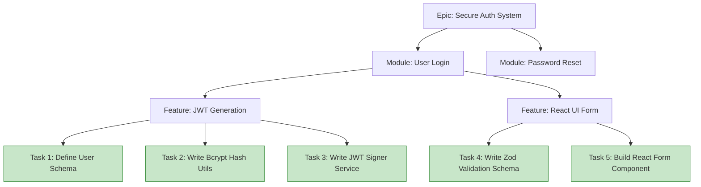

# Part 6: Project Breakdown

Large AI prompts fail. It is a fundamental limitation of current LLMs. If you ask an AI to "Build a complete CRM system," it will try to generate the database, backend, and frontend simultaneously. It will run out of output tokens, lose context midway, hallucinate variables, and produce code that is fundamentally broken.

---

## 1. The "One Task = One Prompt" Rule

Senior engineers never build a whole system at once. They build modules. They build features. They build functions. You must manage your AI agent using the exact same methodology.

### The Enterprise Work Breakdown Structure (WBS)
* **Epic:** HR Management System (Too big for AI)
* **Module:** Leave Management (Too big for AI)
* **Feature:** Apply for Leave (Borderline, but usually too big)
* **Task:** Create `LeaveRequest` Database Schema (Perfect for AI)
* **Task:** Create `LeaveRequest` API Endpoint (Perfect for AI)

---

## 2. Visualizing the WBS

**The Golden Rule:** You only ever feed the green boxes (Tasks) to the AI for coding. 

---

## 3. The Sequence of Tasks Matters

You cannot ask the AI to build the React UI Form (Task 5) if the Validation Schema (Task 4) or the API Contract hasn't been defined yet. The AI will hallucinate the API endpoint name and the payload structure.

**Correct Sequencing:**
1. **Design:** Define Interfaces, API Contracts, and Schemas.
2. **Infrastructure:** Build Database models and external integrations.
3. **Logic:** Build the Domain services (Backend).
4. **Presentation:** Build the UI (Frontend).
5. **Testing:** Write Unit and Integration tests.

---

## 4. Hands-on Exercise: Task Breakdown

**Scenario:**
Manager: *"We need a notification service that sends an email to the user when they successfully register for an account."*

**Your Task:**
Break this Feature down into at least 4 distinct, sequential tasks that you would assign to an AI one by one. Ensure they follow the correct architectural sequence.

> **Staff Engineer Solution & Rationale:**
> 1. **Task 1 (Design/Interface):** Define the `EmailProviderInterface` and the `UserRegisteredEvent` payload structure in the Domain Layer.
> 2. **Task 2 (Infrastructure):** Implement the `SendGridEmailProvider` class that implements the interface from Task 1.
> 3. **Task 3 (Logic):** Create the `UserRegisteredEventHandler` that listens for the event and calls the email provider interface.
> 4. **Task 4 (Testing):** Write unit tests for the event handler, strictly mocking the email provider so it doesn't send real emails during testing.
> 
> *Rationale: If you ask the AI to "build the email notification feature," it will tightly couple the SendGrid SDK directly inside your user registration controller. By breaking it down, you force it to decouple the logic.*

---

## 5. Review Checklist

- [ ] I will never ask the AI to build an entire Feature or Module in a single prompt.
- [ ] I will enforce the "One Task = One Prompt" rule.
- [ ] I will sequence tasks logically, starting with Interfaces/Contracts, then Backend, then Frontend.
- [ ] I understand that breaking tasks down prevents the AI from hallucinating dependencies.

**Next Steps:**
In Part 7, we will learn how to write the specific, highly-engineered prompts for these tiny tasks.
