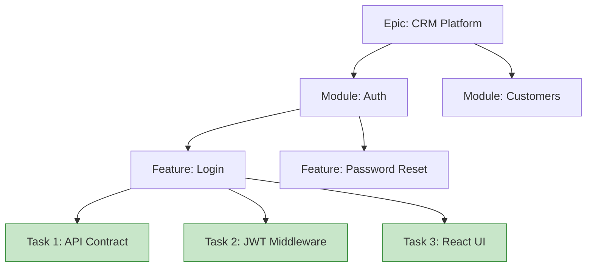

# Part 6: Project Breakdown

Large AI prompts fail. If you ask an AI to "Build a CRM," it will try to generate the database, backend, and frontend all at once. It will run out of output tokens, lose context, and the code will be fundamentally broken.

## 1. The "One Task = One Prompt" Rule

Senior engineers never build a whole system at once. They build modules. They build features. They build functions. You must manage AI the exact same way.

**Enterprise Hierarchy:**
* **Epic:** HR Management System
* **Module:** Leave Management
* **Feature:** Apply for Leave
* **Task:** Create `LeaveRequest` Database Schema
* **Subtask:** Write database migration script

## 2. Work Breakdown Structure (WBS)

**Rule:** You only ever feed the green boxes (Tasks) to the AI for coding.

### Common Mistakes
* **Developer Mistake:** Prompting "Build the Login Feature" (Box D).
* **AI Mistake:** Creating the UI, but hallucinating the API endpoint because it wasn't built yet.

## 3. Practical Exercise: Task Breakdown

**Scenario:**
Manager: *"We need a notification service that sends an email when a user registers."*

**Your Task:**
Break this down into at least 4 distinct, sequential tasks that you would assign to an AI one by one.

### 4. Review & Staff Engineer Approach

**Staff Engineer Breakdown:**
1. **Task 1 (Design):** Design the `NotificationProvider` interface (Domain Layer).
2. **Task 2 (Infra):** Implement `SendGridEmailProvider` matching the interface (Infrastructure Layer).
3. **Task 3 (Logic):** Create the `UserRegisteredEvent` handler to trigger the notification.
4. **Task 4 (Testing):** Write unit tests for the event handler mocking the email provider.

*Notice:* Each task is tiny, perfectly scoped, and easy for the AI to get 100% correct.

**Next Steps:**
In Part 7, we will learn how to write the specific prompts for these tiny tasks.
