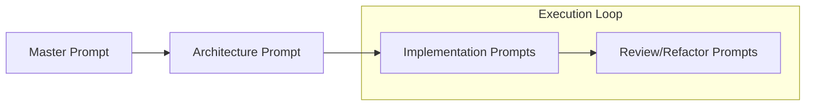

# Part 7: Prompt Engineering

Prompt engineering for software development is very different from prompting ChatGPT to write an email. A software prompt is essentially a highly-structured technical specification.

## 1. Anatomy of a Senior Prompt

A professional prompt for an AI coding tool (like Antigravity, Cursor, or Kiro) must contain:
1. **Role/Context:** Who the AI is acting as.
2. **Task Definition:** Exactly what needs to be built.
3. **Boundaries/Constraints:** What NOT to do.
4. **Input Context:** Which files or docs to read first.
5. **Output Format:** How you want the code delivered.

## 2. Prompt Evolution

* **Master Prompt:** Loaded into the system rules (`.cursorrules` or `PromptRules.md`). Defines overall coding standards.
* **Architecture Prompt:** "Read `requirements.md` and propose a database schema."
* **Implementation Prompt:** "Implement task 2 using the approved schema."
* **Refactor Prompt:** "Extract the email sending logic into a separate service class."

### Common Mistakes
* **Developer Mistake:** "Make the button blue." (Missing context of *which* button and *what* blue).
* **AI Mistake:** Breaking existing functionality because the prompt didn't specify constraints.

## 3. Practical Exercise: Writing a Bug Fix Prompt

**Scenario:**
The `calculate_tax()` function is returning $10.50 instead of $10.00 because it's applying tax to the shipping fee, which is against business rules.

**Your Task:**
Write a prompt to fix this bug. Do not just say "Fix the tax bug."

### 4. Review & Staff Engineer Approach

**Staff Engineer Prompt:**
*"@calculate_tax.py @business_rules.md 
Task: Fix the bug in `calculate_tax()` where tax is incorrectly applied to shipping.
Constraint: Review `business_rules.md` section 4.1. Tax must ONLY apply to the subtotal of items. 
Action: Update the function to exclude shipping from the tax multiplier. 
Output: Provide the updated function and output the updated unit test."*

**Next Steps:**
In Part 8, we map out the exact sequence of how these prompts are chained together in the Development Workflow.
