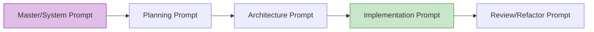

# Part 7: Prompt Engineering

Prompt engineering for software development is fundamentally different from prompting ChatGPT to write an essay. A software prompt is a highly structured technical specification. If your prompt sounds like a conversational request, you are doing it wrong.

---

## 1. Anatomy of a Perfect Senior Prompt

A professional prompt for an AI coding tool (like Antigravity, Cursor, or Kiro) must contain 5 distinct elements:

1. **Role/Persona:** Who the AI is acting as.
2. **Input Context:** Which files or docs it MUST read before acting.
3. **Task Definition:** Exactly what needs to be built.
4. **Boundaries/Constraints:** What it MUST NOT do (preventing common mistakes).
5. **Output Format:** How you want the result delivered (e.g., Code block, Plan, Diff).

### Example of a Poor (Junior) Prompt
*"Fix the bug in the tax calculator where it's adding tax to shipping. Also make the button red."*
*(Fails because: No context provided, mixes backend and frontend tasks, lacks constraints).*

### Example of a Senior Staff Prompt
*"@tax_service.ts @business_rules.md 
**Role:** Senior Backend Engineer.
**Context:** Read section 4.1 in `business_rules.md`.
**Task:** Fix the bug in `calculateTotal()` where tax is incorrectly applied to the shipping fee.
**Constraints:** Tax MUST ONLY apply to the subtotal of items. DO NOT modify the shipping fee logic. DO NOT use floating point math for currency; use the existing `CurrencyUtils.add()` methods.
**Output:** Output only the modified function. Do not output the entire file."*

---

## 2. The Hierarchy of Prompts

Throughout a project, you will use different types of prompts.

* **Master Prompt (`.cursorrules`):** Universal rules applied to every chat. (e.g., "Always use TypeScript").
* **Planning Prompt:** "Read the requirements. Output a numbered list of tasks to accomplish this. Do not write code."
* **Implementation Prompt:** The actual coding command (like the Senior Staff example above).
* **Refactor Prompt:** Used when the AI's code works, but is ugly. (e.g., "Extract the nested `if/else` statements into a switch case and apply early returns.")

---

## 3. Hands-on Exercise: Writing a Refactor Prompt

**Scenario:**
The AI generated a working function called `processOrder(order)`. However, the function is 150 lines long. It validates the user, checks inventory, calculates totals, charges the credit card, and sends an email, all in one massive block of code.

**Your Task:**
Write a strict prompt to instruct the AI to refactor this code according to SOLID principles, specifically the Single Responsibility Principle (SRP).

> **Staff Engineer Solution & Rationale:**
> *"@processOrder.ts
> **Role:** Lead Architect.
> **Task:** Refactor `processOrder()` to strictly adhere to the Single Responsibility Principle. 
> **Constraints:** 
> 1. The main `processOrder` function must act only as an orchestrator.
> 2. Extract the validation, inventory checking, billing, and notification logic into separate private helper methods or separate service classes.
> 3. DO NOT change the external API signature or behavior of `processOrder`.
> **Output:** Provide the refactored orchestrator function and the new extracted methods."*
> 
> *Rationale: By giving the AI specific boundaries (act as an orchestrator, don't change the external signature), we prevent it from rewriting the entire module and breaking the rest of the app.*

---

## 4. Review Checklist

- [ ] I will stop using conversational prompts like "Please can you make..."
- [ ] My implementation prompts will always include Context, Task, Constraints, and Output Format.
- [ ] I will explicitly state what the AI MUST NOT do (Constraints).
- [ ] I will use Refactor Prompts to clean up messy AI code before merging it.

**Next Steps:**
In Part 8, we map out the exact sequence of how these prompts are chained together into an unbreakable Development Workflow.
