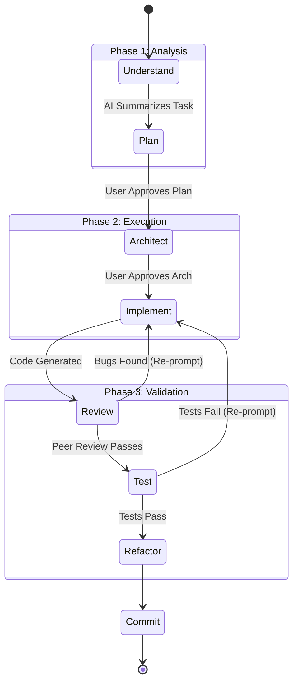

# Part 8: AI Development Workflow

This is the core engine of Vibe Coding. The secret to building enterprise software with AI is not having a magic prompt; it is rigorously enforcing the sequence of events. If you skip a step, the AI will hallucinate. If you reverse a step, you will introduce massive technical debt.

---

## 1. The Strict Execution Sequence

You must act as the brake pedal. The AI wants to generate code instantly. You must force it to analyze, plan, and verify first.

---

## 2. Breaking Down the Phases

### Step 1: Understand & Plan (No Code Allowed)
**Your Prompt:** *"@requirements.md Task: Implement Forgot Password. **First step: Do not write any code.** Analyze the current auth flow and provide a step-by-step implementation plan. Wait for my approval."*
**Why:** If the AI's plan is wrong, you fix the text. If the AI's code is wrong, you spend hours debugging.

### Step 2: Architect (Interfaces Only)
**Your Prompt:** *"Plan approved. Now, generate ONLY the TypeScript interfaces and Database Schemas required for this plan. Do not implement the logic yet."*
**Why:** Reviewing an interface takes 10 seconds. Reviewing 500 lines of logic takes 10 minutes. Fix the data contracts first.

### Step 3: Implement (Module by Module)
**Your Prompt:** *"Interfaces approved. Implement Task 1 (Database Layer) using the approved schema."*
**Why:** Keeping the generation scope small ensures high accuracy and prevents the AI from hitting output token limits.

### Step 4: Review & Refactor (Quality Gate)
**Your Prompt:** *"Review your generated code for SOLID principles. Extract the email sending logic into a separate utility function to improve readability."*
**Why:** AI often writes working but messy code. You must force it to clean up after itself before committing.

---

## 3. Hands-on Exercise: Forcing the Sequence

**Scenario:**
You need to add a new "Upload Profile Picture" feature. It requires an S3 bucket integration, a database update, and a UI component.

**Your Task:**
Write the very first prompt you send to the AI to initiate this feature, ensuring it does not jump to writing the React component or the AWS SDK logic.

> **Staff Engineer Solution & Rationale:**
> *"@upload_requirements.md @Architecture.md
> **Task:** Implement Profile Picture Upload.
> **Constraint 1:** DO NOT WRITE ANY CODE YET.
> **Constraint 2:** Read the architecture guidelines regarding external storage.
> **Action:** Provide a numbered list of the files that will need to be created or modified, and a brief description of what will change in each. 
> Wait for my explicit approval on this plan before proceeding to code generation."*
> 
> *Rationale: The AI is explicitly blocked from coding. By asking for a list of files, you can instantly see if it plans to violate architecture (e.g., if it plans to import AWS S3 directly into the `Profile.tsx` React component).*

---

## 4. Review Checklist

- [ ] I will never let the AI jump directly from a requirement to code generation.
- [ ] I will force the AI to output a Plan and wait for my approval.
- [ ] I will generate Interfaces and Schemas before generating business logic.
- [ ] I will actively re-prompt the AI to refactor its own messy code before accepting it.

**Next Steps:**
In Part 9, we dive deep into Code Review and Debugging—because despite your best efforts, the AI *will* make mistakes, and you must know how to catch and fix them systemically.
