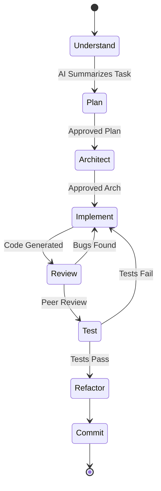

# Part 8: AI Development Workflow

This is the core engine of Vibe Coding. You must rigorously enforce the sequence of events. If you skip a step, the AI will hallucinate. If you reverse a step, you will introduce technical debt.

## 1. The Strict Execution Sequence

Never let the AI jump directly into coding. Always force it to analyze, plan, and verify first.

## 2. Phase Breakdown

1. **Understand:** Prompt the AI to read the task and documentation, and explain its understanding back to you. *Do not let it code.*
2. **Plan:** Ask the AI to list the files it intends to create or modify. Review this list.
3. **Architect:** Ask the AI for the interface contracts or schemas. Approve them.
4. **Implement:** Finally, tell the AI: *"Proceed with implementation based on the approved plan."*
5. **Review:** Act as the Senior Engineer. Review the AI's code for SOLID principles and security.
6. **Refactor:** AI code often works but is messy. Prompt it to clean up, extract methods, and improve naming.

### Common Mistakes
* **Developer Mistake:** Skipping the 'Plan' phase.
* **AI Mistake:** Overwriting an entire file with a slightly modified version because you didn't force it to plan the diff first.

## 3. Practical Exercise: Forcing the Sequence

**Scenario:**
You need to add a "Forgot Password" flow.

**Your Task:**
What is the very first prompt you send to the AI?

### 4. Review & Staff Engineer Approach

**Staff Engineer Approach:**
*"@auth_module Task: Implement Forgot Password. Read `SecurityRules.md`. First step: Do not write any code. Analyze the current auth flow and provide a step-by-step implementation plan and a list of files that will be modified. Wait for my approval."*

By explicitly telling it to wait, you maintain control of the workflow.

**Next Steps:**
In Part 9, we dive into Code Review and Debugging—because AI *will* make mistakes, and you must know how to catch them.
