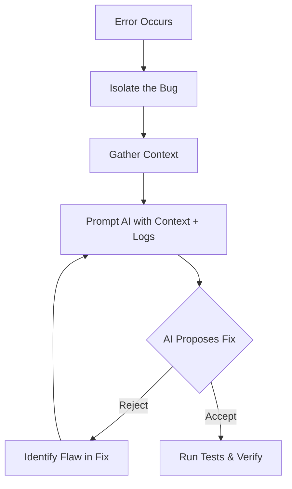

# Part 9: Code Review & Debugging

AI will write bad code. It will write insecure code. It will write unscalable code. Your job as a Senior Vibe Coder is not to write the code, but to act as the ultimate gatekeeper for quality.

## 1. How to Review AI-Generated Code

You must approach AI code as if a very fast, very confident junior developer wrote it.

**The Senior Review Checklist:**
* **Architecture:** Did it put database queries in the UI component?
* **Security:** Did it sanitize inputs? Are secrets hardcoded?
* **Performance:** Is it doing N+1 queries in a loop?
* **SOLID:** Is the function doing one thing, or 10 things?
* **Maintainability:** Are the variables named `data1` and `res`, or `userData` and `authResponse`?

## 2. Debugging Workflow with AI

When an error occurs, do not just paste the stack trace into the AI and say "fix it".



**How to gather context:**
1. Find the exact file and line number.
2. Get the specific error log.
3. Understand the expected behavior vs actual behavior.

### Common Mistakes
* **Developer Mistake:** Pasting a 500-line stack trace into the AI without looking at it.
* **AI Mistake:** Proposing a "fix" that suppresses the error (like adding a `try/catch` that does nothing) instead of solving the root cause.

## 3. Practical Exercise: Reviewing AI Code

**Scenario:**
The AI generated this code for user authentication:
```javascript
function login(username, password) {
    let user = db.query("SELECT * FROM users WHERE username = '" + username + "'");
    if (user && user.password == password) {
        return true;
    }
    return false;
}
```

**Your Task:**
Identify at least 3 critical issues that a Senior Engineer would reject in a Code Review.

### 4. Review & Staff Engineer Approach

**Staff Engineer Review:**
1. **Security:** SQL Injection vulnerability. It concatenates raw input into the query.
2. **Security:** Passwords are being stored and compared in plain text. It must use hashing (e.g., bcrypt).
3. **Architecture:** Database queries (`db.query`) are mixed directly into the domain logic function.

**Next Steps:**
In Part 10, we cover how to take approved, reviewed code and prepare it for Production Deployment.
